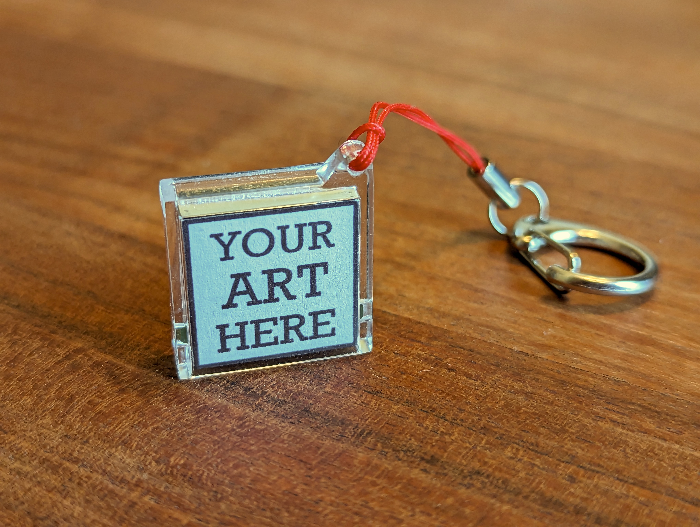

# HotClasps (HitClips compatible audio cartridge)
This repository contains the hardware, software, and enclosure CAD for the HotClaps cartridge (and accomanying debugger). It will play any audio through Tiger Electronics' [HitClips](https://en.wikipedia.org/wiki/HitClips) players.

### Context 
This is a complete rebuild of my [Homebrew HitClips](https://hackaday.io/project/183495-homebrew-hitclips) project from 2022.

### Features
* Significantly improved audio quality over the original toys (hard to quantify, but the bar was low).
* Space for ~10 minutes of audio, which can be split across multiple files. This can theoretically be extended if you dial back the audio quality further.
* USB Storage interface for dragging/dropping audio files from a computer.
* [Web application](https://www.hotclasps.com) with tools to convert audio files and print custom artwork for the case. (Source code for web app [here](https://github.com/dupontgu/hc-webapp))

### Notes
* The hardware is built around the Raspberry Pi RP2040 microcontroller.
* The firmware is written in [CircuitPython](https://circuitpython.org/), and features an audio driver written in [pioasm](https://rp2040pio-docs.readthedocs.io/en/latest/pio-programs.html).
