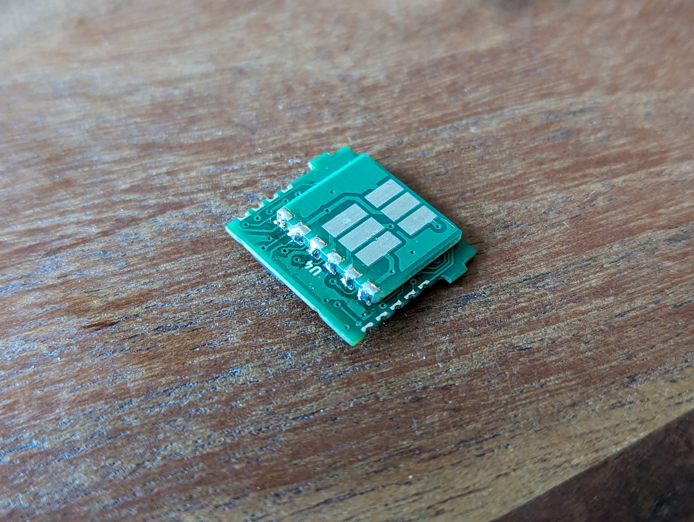

## Notes
* Cartridge is comprised of two PCBs - the main board, and an adapter which extends the thickness so that the cartridge makes direct contact with a HitClips player.
* Main board should be 0.8mm thick, adapter should be 1.2mm.

Front        |  Back
:-------------------------:|:-------------------------:
  |  